<!-- .slide -->

# What is AI in Coding?

## **Artificial Intelligence for Developers**

- **Code Completion**: Auto-suggest code as you type
- **Code Generation**: Create entire functions from descriptions
- **Documentation**: Generate comments and README files
- **Debugging**: Identify and fix bugs automatically
- **Refactoring**: Improve code structure and performance
- **Testing**: Generate test cases and scenarios

##--##

<!-- .slide -->

# Key AI Terms Explained Simply

## **Large Language Models (LLMs)**
- **GPT-4, Claude, Gemini**: AI models trained on vast amounts of text
- **Understanding**: Can read and write code like humans
- **Context**: Remember previous conversation parts

## **Code AI vs Chat AI**
- **GitHub Copilot**: Specialized for coding tasks
- **ChatGPT**: General-purpose, good for explanations
- **Claude**: Excellent for complex reasoning and long contexts

##--##

<!-- .slide -->

# How AI Tools Help Developers

## **Productivity Boost**
- ⚡ **Faster Development**: 30-50% speed increase reported
- 🔍 **Learning**: Discover new patterns and best practices
- 🧠 **Mental Load**: Reduce cognitive burden on routine tasks

## **Quality Improvement** 
- ✅ **Fewer Bugs**: AI catches common mistakes
- 📚 **Better Documentation**: Consistent, comprehensive docs
- 🔧 **Code Quality**: Suggests improvements and optimizations

Notes:
Studies show developers using AI tools like GitHub Copilot report significant productivity gains. The key is learning to use them effectively, which starts with understanding how to communicate with AI through prompts.

##--##

<!-- .slide -->

# Tokens and Context Windows

- Models read text as tokens (sub-word units)
- Context window = maximum tokens per request (prompt + output)
- Truncation happens if you exceed limits; summarize or retrieve selectively

Notes:
Be mindful of token budgets; include only what the model needs.

##--##

<!-- .slide -->

# Embeddings and Vector Search

- Embedding: numeric representation of text/code meaning
- Similarity search: find nearest neighbors in vector space
- Use cases: semantic search, deduplication, recommendations

##--##

<!-- .slide -->

# RAG: Retrieval-Augmented Generation

- Retrieve relevant context, then generate
- Benefits: fresher knowledge, grounded answers, citations
- Risks: poor retrieval = hallucinations; use chunking and evals

##--##

<!-- .slide -->

# Cost, Latency, and Quality

- Small vs large models: trade speed/cost for reasoning power
- Batch and cache frequent prompts; stream outputs for UX
- Temperature/sampling: lower = more deterministic, higher = more creative

```mermaid
graph TD
    Q[Quality] -->|↑| Cost
    Q -->|↑| Latency
    S[Smaller Model] -->|↓Cost, ↓Latency| Q
    L[Larger Model] -->|↑Cost, ↑Latency| Q
```

## See also
- Lab 01 for prompt practice: ../../labs/lab-01-prompt-basics/README.md
- Tools & Agents overview: 14_tools_and_agents.md
