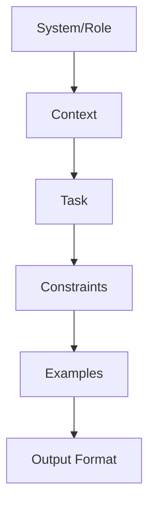
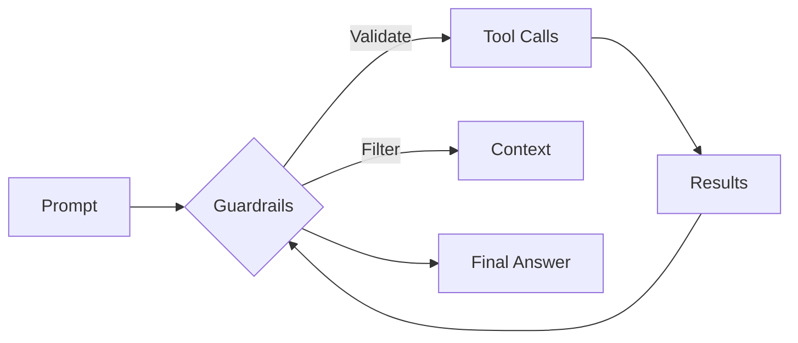

<!-- .slide -->

# Prompt Engineering Basics

## **What is a Prompt?**
A prompt is how you "talk" to an AI agent to get the results you want

## **Basic Prompt Structure**
```
[Context] + [Task] + [Format] + [Examples]
```

##--##

<!-- .slide: class="with-code" -->

# Prompt Engineering Examples

## **❌ Bad Prompt**
```
write code
```

## **✅ Good Prompt**
```
Write a TypeScript function that validates email addresses.
Requirements:
- Use regex pattern for validation
- Return boolean true/false
- Handle edge cases like null/undefined
- Include JSDoc comments

Example usage:
validateEmail("user@example.com") // should return true
```

##--##

<!-- .slide: class="with-code" -->

# Effective Prompt Patterns

## **1. Role-Based Prompts**
```
Act as a senior TypeScript developer.
Review this code and suggest improvements...
```

## **2. Step-by-Step Instructions**
```
Create a React component following these steps:
1. Define the component props interface
2. Create the functional component
3. Add proper TypeScript types
4. Include error handling
```

## **3. Context + Constraints**
```
Given this existing codebase [paste code],
add a new feature that [describes feature]
while maintaining the current architecture and coding style.
```

Notes:
Prompt engineering is like learning a new language for communicating with AI. The more specific and structured your prompts, the better results you'll get. Practice with different patterns to find what works best for your coding style.

##--##

<!-- .slide -->

# Prompt Anatomy (Visual)



Tips:
- Keep system/role stable across iterations
- Pin output schemas when possible (JSON, diff)

##--##

<!-- .slide -->

# Anti-patterns and Fixes

- Vague asks → Add task, constraints, and examples
- Overlong context → Minimize, retrieve, or summarize
- One-shot big changes → Ask for a minimal diff with summary
- Hidden requirements → State acceptance criteria upfront

## Delta requests
- Prefer: "Provide a unified diff with only the changes"
- Avoid: "Rewrite the file"

##--##

<!-- .slide -->

# Safety and Privacy Guardrails

- No secrets/tokens/PII in prompts or examples
- Use synthetic or anonymized data in demos
- Ask for reasoning summaries, not raw chain-of-thought
- Validate tool outputs against schemas; log deltas



##--##

<!-- .slide: class="with-code" -->

# Few-shot and Self-Consistency

- Provide 2–3 high-quality examples
- Ask model to generate N candidates and pick best (when cost allows)

```
Provide 2 worked examples, then:
Generate 3 candidate test cases for edge conditions.
Return as JSON array; include rationale per case (1 sentence).
```

##--##

<!-- .slide: class="with-code" -->

# Lightweight Evals Pattern

```
Inputs: function signature + description
Task: propose 3 tests (happy, edge, error)
Format: JSON { name, input, expected }
Success: All tests pass locally
```

Connect to labs:
- Lab 01: basic prompts
- Lab 03: add evals to your workflow
