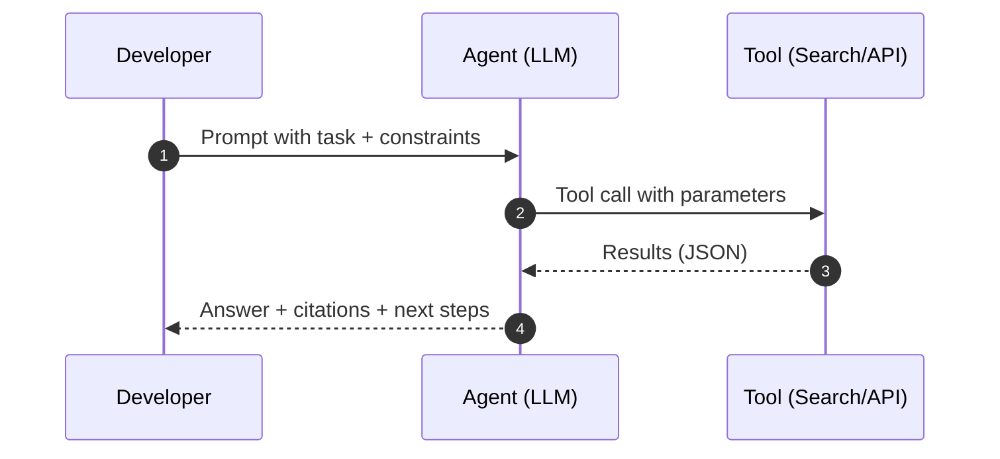
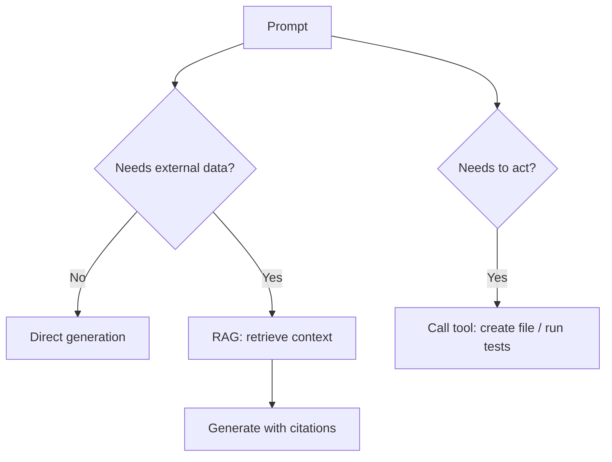
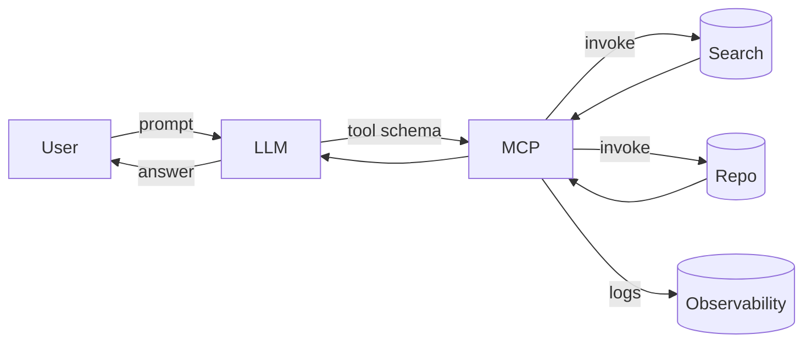

```markdown
<!-- .slide -->

# Tools & Agents Overview

## Why tools and agents?
- Extend LLMs with actions: search, code edits, API calls
- Combine reasoning with execution for end-to-end tasks
- Improve reliability with tool constraints and checks



Notes:
Agents plan, call tools, and synthesize results. Guardrails make this safe and predictable.

##--##

<!-- .slide: class="with-code" -->

# Common Tools for Devs

- IDE assistants: GitHub Copilot, Copilot Chat, Cursor
- General LLMs: ChatGPT, Claude, Gemini
- Retrieval: Vector DBs (FAISS, Pinecone), RAG frameworks
- Code operations: Search, refactor, test, run



##--##

<!-- .slide -->

# Model and Tool Limitations

- Context windows: truncate or summarize inputs
- Determinism: temperature and sampling impact results
- Latency and costs: batch, cache, stream where possible
- Tool reliability: handle timeouts, retries, validation
- Privacy & safety: no secrets in prompts; least-privilege tools

## Guardrails
- Allowlist tools and parameters
- Timeouts and max-iterations
- Output schemas (JSON schema, Zod) and validation
- Human-in-the-loop checkpoints

##--##

<!-- .slide: class="with-code" -->

# Tool-Augmented Prompt Pattern

```
Role: Senior DevOps engineer
Task: Provision a CI check that runs unit tests and lint in Nx workspace
Constraints:
- Provide only the patch diff in unified format
- Do not modify unrelated files
- Include a brief summary after the diff
Tools available: file.search, file.apply_patch, run.command
Checks:
- If tests fail, revert changes and propose a safe fallback
```

Notes:
Clear roles, explicit tools, constraints, and success checks produce safer automation.

##--##

<!-- .slide: class="with-code" -->

# Copilot Chat Examples

```
/explain Why is this test flaky? Consider timing and async.
/fix Select the function and propose a minimal patch.
/tests Generate Jest tests for edge cases for src/math.ts
```

Tips:
- Select code for best context
- Ask for deltas, not rewrites
- Request tests and rationale

##--##

<!-- .slide -->

# MCP and Interop (Conceptual)

- Model Context Protocol (MCP): standard way to expose tools to LLMs
- Benefits: portability, security, observability
- Design: tool schemas, auth, rate limits, logging



## See also
- Lab 02: ../../labs/lab-02-tool-setup/README.md
- Deeper dives: 21_ai_tools_landscape.md, 22_copilot_setup.md, 23_autonomous_agents.md

```